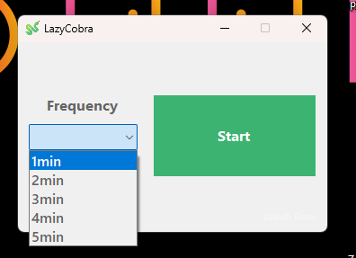

# Project name: LazyCobra
(its my wife nickname)

# Description:
LazyCobra is a small application written in Windows Forms, designed to have fun and explore the framework. The application simulates the gentle movement of the mouse cursor at specified intervals, allowing it to show activity on the computer even during breaks when the user is inactive. This feature can be useful in situations where it is important to maintain the system's active state, such as in presentations, to avoid screen interruptions. In addition, the application allows you to adjust the frequency of mouse movement from 1 to 5 minutes, allowing you to tailor it to your specific needs.

# Features:
Simulates the gentle movement of the mouse cursor
Customize the frequency of mouse movement from 1 to 5 minutes

# Technologies:
Windows Forms

# Notes:
The project was created for hobby and educational purposes to better understand the Windows Forms Framework. I encourage you to experiment with the code and customize the application according to your own preferences.
 
